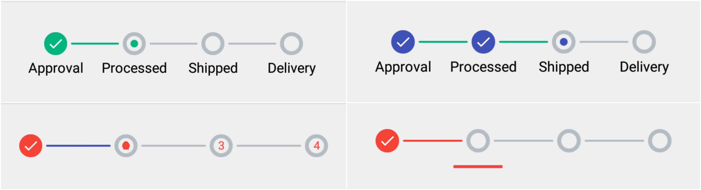
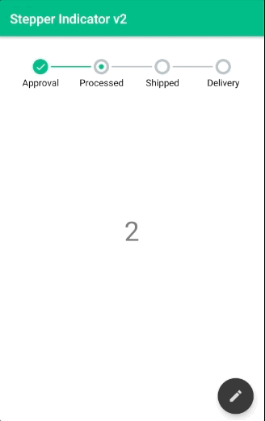

<p align="center">
</img>
</p>

#  Stepper indicator v2

### Pt 2/3

[](https://dashboard.buddybuild.com/apps/58897f27fdfc370100e3eece/build/latest?branch=master)
[](https://upscri.be/b00b87/)
[](https://jitpack.io/#rakshakhegde/stepper-indicator)
[](https://upscri.be/b00b87/)

> ### Designed by the awesome https://dribbble.com/LeslyPyram :)
> ### Check out the release [**here**](https://github.com/rakshakhegde/stepper-indicator/releases)




## Sample

You can checkout the [**Sample Application**](https://play.google.com/store/apps/details?id=com.rakshakhegde.stepperindicator.sample) on the Play Store.

### Please sign up for my newsletter **[rakshakhegde](https://upscri.be/b00b87/)** 📧

Setup
----------------

First, add jitpack in your build.gradle at the end of repositories:
 ```gradle
repositories {
    // ...       
    maven { url "https://jitpack.io" }
}
```

Then, add the library dependency:
```gradle
compile 'com.github.rakshakhegde:stepper-indicator:2.0.0-alpha'
```

Now go do some awesome stuff!

Usage
----------------

```xml
<com.rakshakhegde.stepperindicator.StepperIndicator
    android:layout_width="match_parent"
    android:layout_height="wrap_content"
    app:stpi_stepCount="5"/>
```

Attributes:

<table summary="Attributes"><thead>
<tr>
	<th>Name</th>
	<th>Description</th>
	<th>Default value</th>
	</tr>
</thead><tbody>
<tr>
	<td>stpi_animDuration</td>
	<td>duration of the line tracing animation</td>
	<td>250 ms</td>
	</tr>
<tr>
	<td>stpi_stepCount</td>
	<td>number of pages/steps</td>
	<td></td>
	</tr>
<tr>
	<td>stpi_circleColor</td>
	<td>color of the stroke circle</td>
	<td>#b3bdc2 (grey)</td>
	</tr>
<tr>
	<td>stpi_circleRadius</td>
	<td>radius of the circle</td>
	<td>10dp</td>
	</tr>
<tr>
	<td>stpi_circleStrokeWidth</td>
	<td>width of circle's radius</td>
	<td>4dp</td>
	</tr>
<tr>
	<td>stpi_indicatorColor</td>
	<td>color for the current page indicator</td>
	<td>#00b47c (green)</td>
	</tr>
<tr>
	<td>stpi_indicatorRadius</td>
	<td>radius for the circle of the current page indicator</td>
	<td>4dp</td>
	</tr>
<tr>
	<td>stpi_lineColor</td>
	<td>color of the line between indicators</td>
	<td>#b3bdc2 (grey)</td>
	</tr>
<tr>
	<td>stpi_lineDoneColor</td>
	<td>color of a line when step is done</td>
	<td>#00b47c (green)</td>
	</tr>
<tr>
	<td>stpi_lineStrokeWidth</td>
	<td>width of the line stroke</td>
	<td>2dp</td>
	</tr>
<tr>
	<td>stpi_lineMargin</td>
	<td>margin at each side of the line</td>
	<td>5dp</td>
	</tr>
<tr>
	<td>stpi_showDoneIcon</td>
	<td>show the done check icon or not</td>
	<td>true</td>
	</tr>
<tr>
	<td>stpi_showStepNumberInstead</td>
	<td>display text number for each step instead of bullets</td>
	<td>false</td>
	</tr>
<tr>
	<td>stpi_useBottomIndicator</td>
	<td>display the indicator for the current step at the bottom instead of inside bullet</td>
	<td>false</td>
	</tr>
<tr>
	<td>stpi_useBottomIndicatorWithStepColors</td>
	<td>use the same color for the bottom indicator as the step color</td>
	<td>false</td>
	</tr>
<tr>
	<td>stpi_bottomIndicatorHeight</td>
	<td>set the height for the bottom indicator component</td>
	<td>3dp</td>
	</tr>
<tr>
	<td>stpi_bottomIndicatorWidth</td>
	<td>set the width for the bottom indicator component</td>
	<td>50dp</td>
	</tr>
<tr>
	<td>stpi_bottomIndicatorMarginTop</td>
	<td>set the top margin for the bottom indicator component</td>
	<td>10dp</td>
	</tr>
<tr>
	<td>stpi_stepsCircleColors</td>
	<td>use multiple colors for each step (array of colors with the size at least the same size as the stpi_stepCount
	value)</td>
	<td></td>
	</tr>
<tr>
	<td>stpi_stepsIndicatorColors</td>
	<td>use multiple colors for each step indicator (array of colors with the size at least the same size as the
	stpi_stepCount value)</td>
	<td></td>
	</tr>
<tr>
	<td>stpi_labels</td>
	<td>supply an array of strings to show labels for every step indicator</td>
	<td></td>
	</tr>
<tr>
	<td>stpi_showLabels</td>
	<td>Show labels for each step indicator. Useful for timelines or checkpoints.</td>
	<td>false</td>
	</tr>
<tr>
	<td>stpi_labelMarginTop</td>
	<td>Top margin for the labels</td>
	<td>2dp</td>
	</tr>
<tr>
	<td>stpi_labelSize</td>
	<td>Size for the labels</td>
	<td>12sp</td>
	</tr>
<tr>
	<td>stpi_labelColor</td>
	<td>Color for the labels</td>
	<td>android:textColorSecondary defined in your project</td>
	</tr>
</tbody></table>


```java
indicator.setViewPager(pager);
// or keep last page as "end page"
indicator.setViewPager(pager, pager.getAdapter().getCount() - 1); //
// or manual change
indicator.setStepCount(3);
indicator.setCurrentStep(2);
```


## Created & Maintained By

[Rakshak R.Hegde](https://github.com/rakshakhegde) ([@rakshakhegde](https://twitter.com/rakshakhegde)) Wanna contribute to this project? Pull requests welcome ❤️

> **Note:** This project is a part of an ongoing series of open-source projects I'm working on. If you liked my work, please consider following me on **[Twitter @rakshakhegde](https://twitter.com/rakshakhegde)** and **[Github](https://github.com/rakshakhegde)**. Also please **share** this project with fellow developers. I'm also starting a newsletter of my own called **[rakshakhegde 📧](https://upscri.be/b00b87/)**. It would be great if you could fill in your email address and subscribe to my new project announcements, releases or blog posts. Subscribe [**here**](https://upscri.be/b00b87/) :)

## License
```
The MIT License (MIT)

Copyright (c) 2017 Rakshak Hegde

Permission is hereby granted, free of charge, to any person obtaining a copy
of this software and associated documentation files (the "Software"), to deal
in the Software without restriction, including without limitation the rights
to use, copy, modify, merge, publish, distribute, sublicense, and/or sell
copies of the Software, and to permit persons to whom the Software is
furnished to do so, subject to the following conditions:

The above copyright notice and this permission notice shall be included in all
copies or substantial portions of the Software.

THE SOFTWARE IS PROVIDED "AS IS", WITHOUT WARRANTY OF ANY KIND, EXPRESS OR
IMPLIED, INCLUDING BUT NOT LIMITED TO THE WARRANTIES OF MERCHANTABILITY,
FITNESS FOR A PARTICULAR PURPOSE AND NONINFRINGEMENT. IN NO EVENT SHALL THE
AUTHORS OR COPYRIGHT HOLDERS BE LIABLE FOR ANY CLAIM, DAMAGES OR OTHER
LIABILITY, WHETHER IN AN ACTION OF CONTRACT, TORT OR OTHERWISE, ARISING FROM,
OUT OF OR IN CONNECTION WITH THE SOFTWARE OR THE USE OR OTHER DEALINGS IN THE
SOFTWARE.
```
